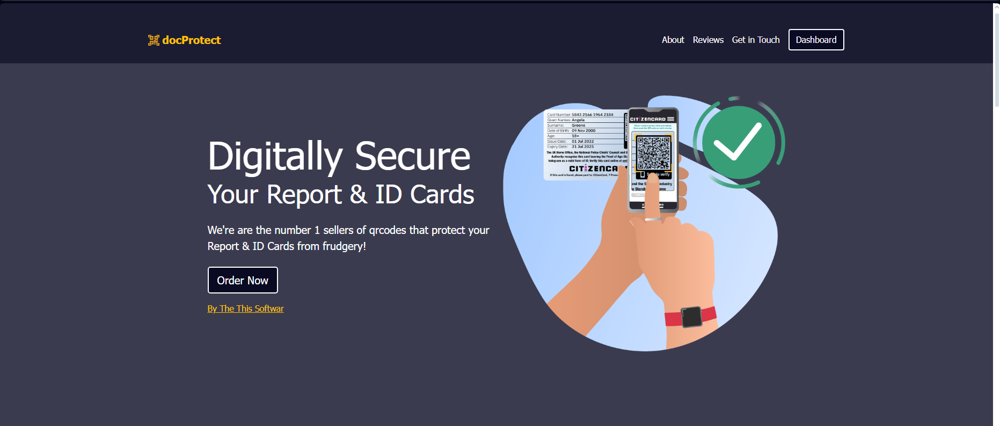
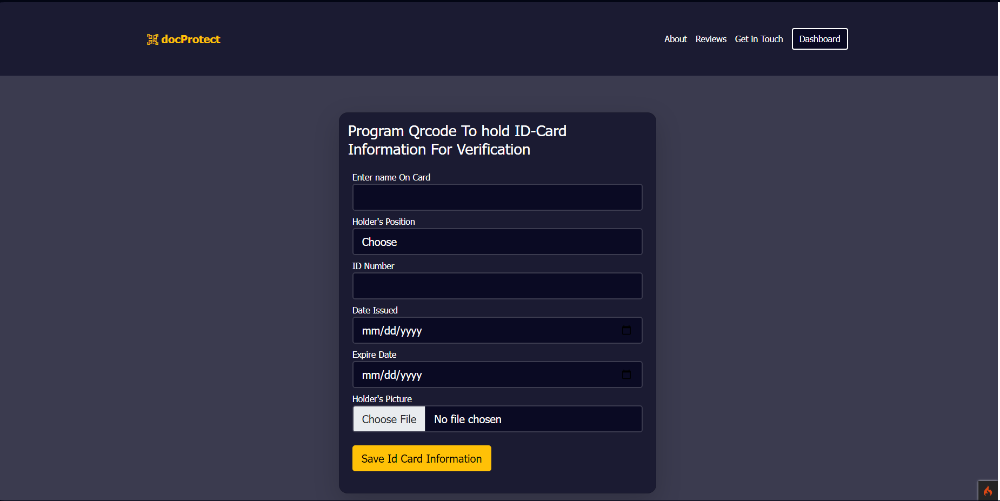
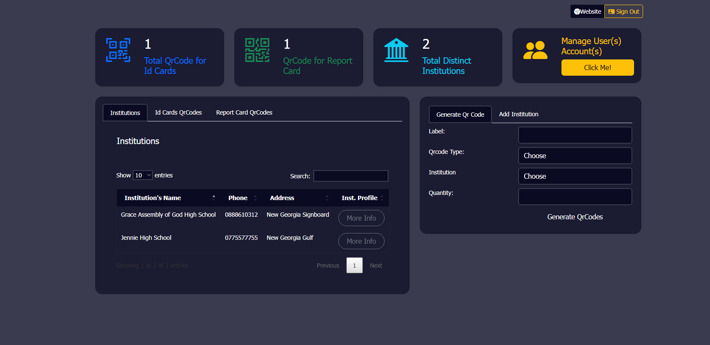
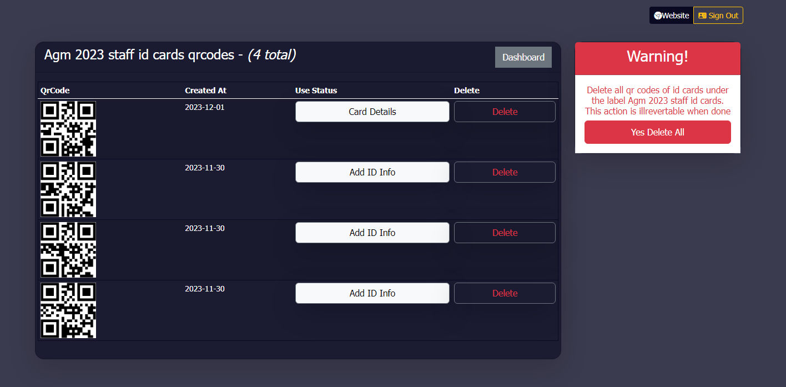

#id card and report card anticounterfeiting software
//codeigniter v4
By: Tarnue Pythagoras

INSTALLATION GUIDE

DB Name: vericationsystem
!!! locate the sqlfile in the root directory of the extracted or clone repo and import in the db created above
### important:
!!! make sure to set your base url in the app/Config/App.php file 

Credentials:
__________________________________
|    EMAIL           | EMAIL      |
----------------------------------
| abc@gmail.com      | 12345678   |  
-----------------------------------
| testuse@gmail.com  | 12345678   |
----------------------------------